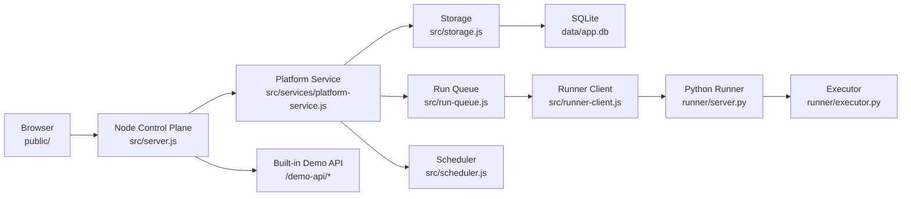

# FlowForge API Lab


一个面向接口自动化测试场景的可运行 MVP，提供从接口资产管理、用例编排、环境配置，到执行调度、报告追踪、OpenAPI 导入的完整闭环。

项目采用前后分层设计：

- Node.js 负责控制台、平台 API、任务编排、调度与数据管理
- Python 负责测试执行、断言计算、变量提取与场景运行
- 前端使用原生 HTML / CSS / JavaScript 构建单页控制台
- 存储默认使用 SQLite，本地启动即可体验完整流程

这个仓库适合以下场景：

- 想快速验证接口测试平台 0 到 1 的产品形态
- 想研究一个轻量级测试平台的分层实现方式
- 想把接口资产管理、执行引擎、调度与报告串成一条完整链路

## 功能特性

- 项目 / 服务 / 模块 / 接口四层资产管理
- 用例编写、断言、变量提取、前后置脚本
- 环境变量、鉴权配置、模板渲染
- 场景编排、步骤顺序、失败控制、变量传递
- 手动执行、定时执行、CI Token 触发执行
- 本地任务队列、并发控制、取消执行、失败重试
- 执行报告、步骤明细、分享链接
- OpenAPI 3.x JSON 导入
- 内置 Demo API，启动后可直接验证完整业务链路
- 内置用户治理、密码修改、重置密码、会话回收等平台能力

## 技术架构



### 架构分层说明

#### 1. 控制台层

Node 服务统一对外提供：

- 前端静态页面
- 平台业务 API
- 登录与会话鉴权
- OpenAPI 导入
- 报告分享查询
- 内置 Demo API

入口文件：`src/server.js`

#### 2. 领域服务层

`src/services/platform-service.js` 是平台核心编排层，负责：

- 用户登录、改密、权限与会话管理
- 项目、接口、用例、套件等核心实体的增删改查
- 执行触发、CI 触发、调度刷新
- 审计日志、版本快照、治理汇总
- 组装控制台 bootstrap 数据

#### 3. 存储层

`src/storage.js` 负责本地数据持久化：

- 默认写入 `data/app.db`
- 首次启动时可从 `data/db.json` 迁移并生成 SQLite 数据
- 对平台的各类集合数据做统一读写和基础规范化

当前存储集合包括：

- `users`
- `projects`
- `services`
- `modules`
- `apis`
- `cases`
- `datasets`
- `environments`
- `suites`
- `versions`
- `auditLogs`
- `runs`

#### 4. 调度与执行层

- `src/run-queue.js` 负责任务入队、优先级、并发数、取消、重试、恢复未完成任务
- `src/scheduler.js` 负责按套件配置定时触发执行
- `src/runner-client.js` 负责把执行请求转发给 Python Runner

#### 5. Python Runner 层

Python Runner 是真正的执行引擎：

- `runner/server.py` 暴露 `/health` 与 `/execute-suite` 接口
- `runner/executor.py` 负责模板渲染、HTTP 请求发送、断言执行、变量提取、脚本运行、结果汇总

Runner 当前基于 Python 标准库实现，无第三方依赖，适合作为后续接入 `pytest`、`httpx`、`allure` 或独立 worker 的基础版本。

## 执行链路

一次测试执行的主流程如下：

1. 前端在控制台发起手动执行、批量执行、调度执行或 CI 触发。
2. Node 控制台读取套件、环境、用例和变量快照。
3. `RunQueue` 生成运行记录并进入本地队列。
4. `RunnerClient` 调用 Python Runner 的 `/execute-suite`。
5. Python Runner 根据快照执行场景步骤，请求目标 API，并计算断言和提取变量。
6. 执行结果回写到 SQLite，前端实时轮询展示报告。
7. 报告可通过 `shareToken` 生成只读分享链接。

## 源码结构

```text
.
├── data/                         # SQLite 数据、旧版 JSON 数据、运行时信息
├── public/                       # 前端控制台
│   ├── app.js                    # 前端主入口
│   ├── index.html                # 控制台页面骨架
│   ├── styles.css                # 全局样式
│   └── app/
│       ├── auth.js               # 登录、鉴权状态、会话持久化
│       ├── collections.js        # 资产列表与集合操作
│       ├── execution.js          # 执行触发与实时状态
│       ├── governance.js         # 用户治理与平台治理视图
│       ├── modal.js              # 表单弹窗与编辑交互
│       ├── reports.js            # 报告中心
│       ├── starter-presets.js    # 预置模板与演示数据入口
│       ├── ui.js                 # UI 片段与交互拼装
│       └── view-model.js         # 前端状态和视图组装
├── runner/
│   ├── executor.py               # Python 执行器
│   └── server.py                 # Python Runner 服务
├── scripts/
│   └── start-platform.js         # 一键启动 Node + Python，并清理陈旧进程
├── src/
│   ├── assertions.js             # 断言辅助
│   ├── executor.js               # 历史执行逻辑与兼容实现
│   ├── jsonpath.js               # JSONPath 能力
│   ├── openapi.js                # OpenAPI 导入
│   ├── run-queue.js              # 本地执行队列
│   ├── runner-client.js          # Node -> Python Runner 调用封装
│   ├── sample-data.js            # 示例数据构造
│   ├── scheduler.js              # 定时调度
│   ├── server.js                 # Node 控制台入口
│   ├── storage.js                # SQLite 持久化层
│   ├── template.js               # 模板变量渲染
│   ├── utils.js                  # 通用工具
│   └── services/
│       └── platform-service.js   # 平台核心业务服务
└── package.json
```

## 运行要求

建议本地具备以下运行环境：

- Node.js 18+
- Python 3.9+
- `sqlite3` 命令行工具

说明：

- Node 侧使用了原生 `fetch`，因此建议使用 Node.js 18 或更高版本
- `src/storage.js` 通过系统 `sqlite3` 命令操作数据库，所以需要本机可直接执行 `sqlite3`

## 快速开始

### 1. 安装与启动

推荐开源用户优先使用一键脚本：

```bash
./scripts/bootstrap.sh
```

这个脚本会自动完成以下动作：

- 检查 `node`、`npm`、`python3`、`sqlite3` 是否已安装
- 自动执行 `npm install --no-fund --no-audit`
- 启动 Node 控制台和 Python Runner

如果你只想先安装项目依赖，不立即启动，可以执行：

```bash
./scripts/bootstrap.sh --install-only
```

另外，项目也提供了 npm 别名命令：

```bash
npm run setup
npm run bootstrap
```

兼容历史用法，仓库根目录下的 `./abcd` 现在也会转发到一键脚本：

```bash
./abcd
```

如果你更习惯手动启动，也可以继续使用：

```bash
npm start
```

默认会同时启动：

- Node 控制台：`http://localhost:3000`
- Python Runner：`http://127.0.0.1:8010`
- Demo API 健康检查：`http://localhost:3000/demo-api/health`

### 2. 分别启动服务

```bash
npm run start:runner
npm run start:server
```

### 3. 常用环境变量

```bash
PORT=3000
RUNNER_PORT=8010
RUNNER_URL=http://127.0.0.1:8010
PYTHON_BIN=python3
RUN_CONCURRENCY=1
```

### 4. 一键脚本说明

新增脚本：`scripts/bootstrap.sh`

适用场景：

- 第一次克隆项目后快速启动
- 希望减少用户手动安装和启动步骤
- 作为 GitHub README 推荐入口命令

行为说明：

- 默认模式会先安装 npm 依赖，再执行 `npm start`
- `--install-only` 模式只安装依赖，不启动服务
- 如果本机缺少 `node`、`npm`、`python3` 或 `sqlite3`，脚本会直接提示缺失项并退出

说明：

- 当前 Python Runner 使用标准库实现，因此不需要额外执行 `pip install`
- 目前脚本负责“项目级依赖安装和启动自动化”，系统级依赖仍需用户本机提前安装

## 默认登录账号

平台内置了 3 个演示账号，适合 GitHub 仓库开箱体验：

| 角色 | 用户名 | 默认密码 |
| --- | --- | --- |
| 管理员 | `admin` | `admin123` |
| 测试开发 | `editor` | `editor123` |
| 业务只读 | `viewer` | `viewer123` |

说明：

- 这些账号是本地演示种子数据，不适合生产环境
- 如果你之前改过密码，系统会优先读取现有的 `data/app.db`
- 想恢复默认账号，可删除 `data/app.db`、`data/app.db-shm`、`data/app.db-wal` 后重新启动

### Demo API 演示账号

内置 Demo API 的登录接口 `/demo-api/auth/login` 默认使用：

- 用户名：`demo`
- 密码：`pass123`

它用于演示测试链路，不是控制台登录账号。

## 示例体验路径

仓库自带一套演示项目，默认可以完成以下链路：

1. 登录 Demo API
2. 创建订单
3. 支付订单
4. 查询订单

这套流程对应平台中的项目、接口、用例、场景和环境数据，启动后即可直接执行，无需再搭建外部服务。

## CI 触发执行

平台支持通过 CI Token 触发套件执行，默认 Token 为：

```text
local-ci-token
```

示例：

```bash
curl -X POST http://localhost:3000/api/ci/trigger \
  -H "content-type: application/json" \
  -H "x-ci-token: local-ci-token" \
  -d '{"suiteId":"suite_order_flow","environmentId":"env_local_demo"}'
```

## OpenAPI 导入能力

当前支持：

- OpenAPI 3.x JSON
- 根据 `paths` 自动生成接口定义
- 路径参数自动转换为 `{{vars.xxx}}` 模板
- 导入 Query / Header 参数
- 根据请求体 schema 生成默认 Body 模板
- 根据成功响应 schema 自动生成 `jsonSchema` 断言
- 自动生成默认用例

当前未覆盖：

- YAML 解析
- 更复杂的多服务自动映射
- 外部鉴权协议自动推断

## 断言、模板与脚本能力

### 支持的常见断言

- 状态码断言
- JSONPath 字段断言
- 字段类型断言
- JSON Schema 基础校验
- XPath 文本提取与断言
- 响应时间阈值校验
- Header 断言
- Body 包含断言

### 模板变量

平台和 Runner 共同支持：

- `{{vars.xxx}}`
- `{{env.variables.xxx}}`
- `{{suite.variables.xxx}}`
- `{{now}}`
- `{{timestamp}}`
- `{{random}}`
- `{{uuid}}`

### 脚本兼容能力

Python Runner 对轻量级 JS 风格脚本做了兼容，常见写法可以直接复用，例如：

```text
assert(response.status < 500, "response should not be 5xx");
```

当前兼容：

- `assert(...)`
- `true / false / null`
- `&& / ||`
- `=== / !==`

## 数据与持久化说明

- 首次启动时，如果 SQLite 为空，会从 `data/db.json` 导入初始数据
- 之后的运行数据会持续写入 `data/app.db`
- `data/runtime.json` 用于记录启动脚本生成的运行时进程信息
- `data/backup-*` 为历史备份数据，可按需保留或清理

如果你准备把项目发布到 GitHub，建议确认是否需要保留现有 SQLite 数据文件；若不希望提交运行态数据，可以在仓库中补充 `.gitignore` 规则单独管理。

## 项目定位

FlowForge API Lab 当前更适合作为：

- 接口自动化测试平台的原型项目
- 本地单机可运行的演示平台
- 继续演进为独立执行器、分布式队列、多租户平台的基础版本

它还不是面向生产环境的完整 SaaS 产品，但在架构演示、流程验证和源码阅读方面已经具备较好的完整度。

## 后续演进建议

建议优先往以下方向继续演进：

1. 将 Runner 拆分为独立 Worker + 队列模型
2. 增加更完整的权限体系、组织维度、多用户隔离
3. 接入 Webhook、Pipeline 回传和外部集成
4. 引入 PostgreSQL、Redis 等更适合服务化部署的基础设施
5. 增强契约测试、Mock、数据库断言、消息队列断言等能力

## 贡献说明

欢迎基于 Issue 或 Pull Request 继续完善这个项目。

如果你准备正式开源发布，建议在仓库中额外补充：

- `LICENSE`
- `.gitignore`
- GitHub Actions CI
- 发布截图或演示 GIF
- 更明确的版本规划与 Roadmap
